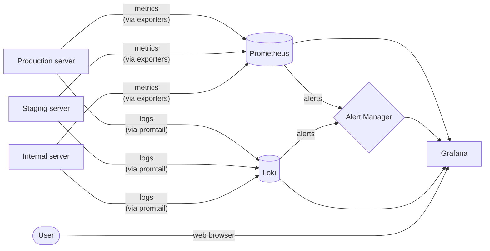

# InNoHassle Server configuration

## Architecture

### Hosts

There are 3 hosts in one network:

- vm20 - Staging server.
  It is used for testing new features before deploying them to production.
- vm21 - Production server.
  It is used for hosting the production services (website, API, bots).
- vm23 - Internal server.
  It is used for internal services such as monitoring tools, hosting GitHub runners, etc.

### Proxying

The main Nginx reverse proxy is installed on vm21.
It proxies all requests from port 80 to the corresponding hosts and ports.

The HTTPS is terminated on another Nginx instance by IT department,
so we don't need to worry about SSL certificates.

### Monitoring



All servers are monitored:

- vm23 is Supervisor server ([configurations](./supervisor)).
  It has Prometheus, Alert Manager, Grafana Loki, and Grafana.
- vm20, vm21, vm23 are Observable servers ([configurations](./observable)).
  They have exporters for Prometheus (Node Exporter, cAdvisor, Nginx Exporter) and Promtail for pushing logs to Loki.

## Deploy

### Set up

To set up everything in this repository, you need to clone it to each server.

Then on one Supervisor server you need to configure secrets:
```bash
cp supervisor/.env.example supervisor/.env
cp supervisor/alertmanager/_secrets/bot_token.example.txt supervisor/alertmanager/_secrets/bot_token.txt
```

Also, you may need to edit configs according to your hosts settings.

### Run

On Supervisor server run the following command:
```bash
cd supervisor
docker compose up -d
```

On Observable servers run the following command:
```bash
cd observable
docker compose up -d
```

Then check the interfaces of Prometheus, Grafana, and Loki to ensure that everything is working correctly.

## Contributing

We are open to contributions of any kind.
You can help us with code, bugs, design, documentation, media, new ideas, etc.
If you are interested in contributing, please read our [contribution guide](https://github.com/one-zero-eight/.github/blob/main/CONTRIBUTING.md).
